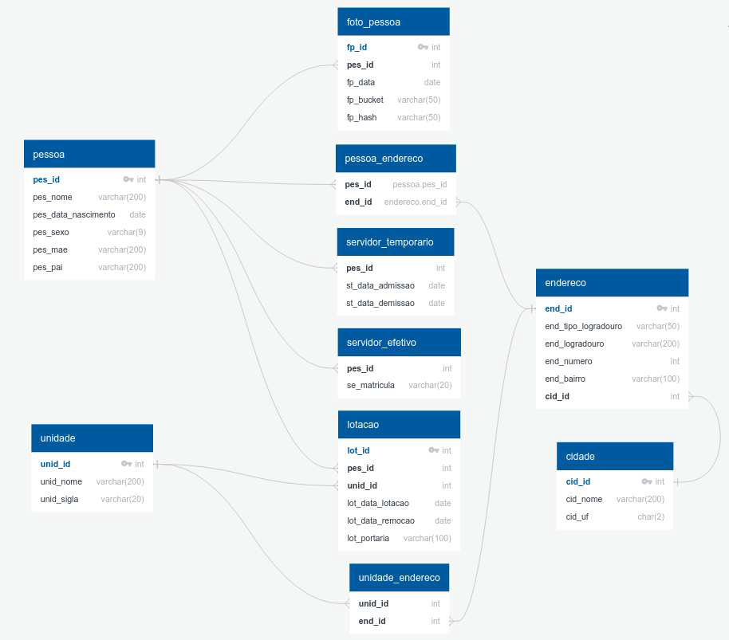

# Processo Seletivo - PSS 02/2025/SEPLAG (Analista de TI - Perfil Junior, Pleno e Sênior)

* Inscrição: 8697
* Nome: Gabriel José Curvo Honda
* Perfil: Desenvolvedor Java Pleno

## Sumário

1. [Considerações sobre a implementação](#considerações-sobre-a-implementação)
2. [Requisitos](#requisitos)
   - [Requisitos Gerais](#requisitos-gerais)
   - [Requisitos Específicos](#requisitos-específicos)
   - [Definição do banco de dados](#definição-do-banco-de-dados)
3. [Implementação dos requisitos](#implementação-dos-requisitos)
   - [Autenticação](#autenticação)
   - [Servidor Efetivo](#servidor-efetivo)
   - [Lotação](#lotação)
   - [Servidor Temporário](#servidor-temporário)
   - [Unidade](#unidade)
   - [Consulta de Servidores Efetivos por Unidade](#consulta-de-servidores-efetivos-por-unidade)
   - [Consulta de Endereço Funcional por Nome do Servidor](#consulta-de-endereço-funcional-por-nome-do-servidor)
   - [Upload e Recuperação de Fotografias](#upload-e-recuperação-de-fotografias)
4. [Configuração do Ambiente](#configuração-do-ambiente)
5. [Tabela de aplicações, URLs e Credenciais](#tabela-de-aplicações-urls-e-credenciais)
6. [Estrutura do Projeto](#estrutura-do-projeto)
   - [Tecnologias Utilizadas](#tecnologias-utilizadas)
7. [Desenvolvimento Local](#desenvolvimento-local)
   - [Pré-requisitos](#pré-requisitos)
   - [Executando a aplicação em modo de desenvolvimento](#executando-a-aplicação-em-modo-de-desenvolvimento)
   - [Compilando o projeto](#compilando-o-projeto)
   - [Executando testes](#executando-testes)
8. [Tabela de variáveis de ambiente](#tabela-de-variáveis-de-ambiente)


## Considerações sobre a implementação

* A aplicação foi desenvolvida utilizando o Java 21, Spring Boot 3.4.4 e última versão disponível do PostgreSQL.
* A estrutura do banco de dados foi criada utilizando o Flyway, que é uma ferramenta de migração de banco de dados.
* A aplicação foi desenvolvida utilizando o padrão MVC porém a organização dos pacotes segue os conceitos da Arquitetura Hexagonal.
* A autenticação foi implementada utilizando o Spring Security com JWT.
  * Ao subir a aplicação será criado um usuário default para que seja possível chamar os outros endpoints ou criar novos usuários. 
  * Username: `administrador@admin.com.br`, Senha: `12345678`
* A documentação da API foi gerada utilizando o [Swagger](http://localhost:8080/swagger-ui/index.html).
* A aplicação possui dois arquivos de configuração do `docker compose`.
  * O `dev.yaml` deve ser utilizado para desenvolvimento local e ele será utilizado pelo `Spring Boot` quando a variável de ambiente `DOCKER_COMPOSE_ENABLED` for `true`.
  * O `compose.yaml` deve ser utilizado para validar o que foi implementado, ele cria a imagem do container da api 
    `sistema-gestao-institucional:latest` quando o parâmetro `--build` é informado no comando `docker-compose up`.
* Os volumes devem ser criados antes de subir a aplicação, na seção abaixo `Configuração do Ambiente` estão os comandos para criar os volumes.
* Foi utilizado a estratégia de `multi-stage build` para que não seja necessário instalar as dependências do `Maven` e `Java` na máquina local.

## Requisitos

Os requisitos abaixo devem ser implementados em uma aplicação web e estão disponíveis no edital.

### Requisitos Gerais

* Implementar mecanismo de autorização e autenticação, bem como não
  permitir acesso ao endpoint a partir de domínios diversos do qual estará
  hospedado o serviço;
* A solução de autenticação deverá expirar a cada 5 minutos e oferecer a
  possibilidade de renovação do período;
* Implementar pelo menos os verbos post, put, get;
* Conter recursos de paginação em todas as consultas;
* Os dados produzidos deverão ser armazenados no servidor de banco
  de dados previamente criado em container;
* Orquestrar a solução final utilizando Docker Compose de modo que
  inclua todos os contêineres utilizados.

### Requisitos Específicos

* Criar um CRUD para Servidor Efetivo, Servidor Temporário, Unidade e
  Lotação. Deverá ser contemplado a inclusão e edição dos dados das
  tabelas relacionadas;
* Criar um endpoint que permita consultar os servidores efetivos lotados
  em determinada unidade parametrizando a consulta pelo atributo unid_id;
  Retornar os seguintes campos: Nome, idade, unidade de lotação e fotografia;
* Criar um endpoint que permita consultar o endereço funcional (da unidade
  onde o servidor é lotado) a partir de uma parte do nome do servidor efetivo;
* Realizar o upload de uma ou mais fotografias enviando-as para o Min.IO;
* A recuperação das imagens deverá ser através de links temporários gerados pela biblioteca do Min.IO com tempo de expiração de 5 minutos.

### Definição do banco de dados



## Implementação dos requisitos

### Autenticação

1. **Gerar Token de Acesso**
   - Endpoint: `POST /v1/auth/token`
   - Payload:
     ```json
     {
       "email": "string",
       "password": "string"
     }
     ```
   - Retorno (HTTP 200):
     ```json
     {
       "data": {
         "accessToken": "string",
         "refreshToken": "string"
       }
     }
     ```
   - Observações:
     - O `accessToken` tem validade de 5 minutos
     - O `refreshToken` tem validade de 1 hora
     - O `accessToken` deve ser enviado no header `Authorization` com o prefixo `Bearer` para acessar os endpoints protegidos

2. **Renovar Token de Acesso**
   - Endpoint: `POST /v1/auth/refresh-token`
   - Header:
     - `Authorization`: Bearer {refreshToken}
   - Retorno (HTTP 200):
     ```json
     {
       "data": {
         "accessToken": "string",
         "refreshToken": "string"
       }
     }
     ```
   - Observações:
     - O `refreshToken` anterior é invalidado ao gerar um novo par de tokens
     - O novo `accessToken` tem validade de 5 minutos
     - O novo `refreshToken` tem validade de 1 hora

### Servidor Efetivo

1. **Criar Servidor Efetivo**
   - Endpoint: `POST /v1/servidores/efetivos`
   - Payload:
     ```json
     {
       "nome": "string",
       "nomeMae": "string",
       "nomePai": "string",
       "sexo": "MASCULINO|FEMININO",
       "dataNascimento": "dd/MM/yyyy",
       "enderecos": [
         {
           "tipoLogradouro": "string",
           "logradouro": "string",
           "numero": 0,
           "bairro": "string",
           "cidade": {
             "nome": "string",
             "uf": "AC|AL|AP|AM|BA|CE|DF|ES|GO|MA|MT|MS|MG|PA|PB|PR|PE|PI|RJ|RN|RS|RO|RR|SC|SP|SE|TO"
           }
         }
       ],
       "matricula": "string"
     }
     ```
   - Retorno (HTTP 201):
     ```json
     {
       "data": {
         "id": 0,
         "nome": "string",
         "nomeMae": "string",
         "nomePai": "string",
         "sexo": "MASCULINO|FEMININO",
         "dataNascimento": "dd/MM/yyyy",
         "enderecos": [
           {
             "tipoLogradouro": "string",
             "logradouro": "string",
             "numero": 0,
             "bairro": "string",
             "cidade": {
               "nome": "string",
               "uf": "AC|AL|AP|AM|BA|CE|DF|ES|GO|MA|MT|MS|MG|PA|PB|PR|PE|PI|RJ|RN|RS|RO|RR|SC|SP|SE|TO"
             }
           }
         ],
         "matricula": "string"
       }
     }
     ```

2. **Buscar Servidor Efetivo por ID**
   - Endpoint: `GET /v1/servidores/efetivos/{id}`
   - Retorno (HTTP 200):
     ```json
     {
       "data": {
         "id": 0,
         "nome": "string",
         "nomeMae": "string",
         "nomePai": "string",
         "sexo": "MASCULINO|FEMININO",
         "dataNascimento": "dd/MM/yyyy",
         "enderecos": [
           {
             "tipoLogradouro": "string",
             "logradouro": "string",
             "numero": 0,
             "bairro": "string",
             "cidade": {
               "nome": "string",
               "uf": "AC|AL|AP|AM|BA|CE|DF|ES|GO|MA|MT|MS|MG|PA|PB|PR|PE|PI|RJ|RN|RS|RO|RR|SC|SP|SE|TO"
             }
           }
         ],
         "matricula": "string"
       }
     }
     ```

3. **Atualizar Servidor Efetivo**
   - Endpoint: `PUT /v1/servidores/efetivos/{id}`
   - Payload:
     ```json
     {
       "id": 0,
       "nome": "string",
       "nomeMae": "string",
       "nomePai": "string",
       "sexo": "MASCULINO|FEMININO",
       "dataNascimento": "dd/MM/yyyy",
       "enderecos": [
         {
           "tipoLogradouro": "string",
           "logradouro": "string",
           "numero": 0,
           "bairro": "string",
           "cidade": {
             "nome": "string",
             "uf": "AC|AL|AP|AM|BA|CE|DF|ES|GO|MA|MT|MS|MG|PA|PB|PR|PE|PI|RJ|RN|RS|RO|RR|SC|SP|SE|TO"
           }
         }
       ],
       "matricula": "string"
     }
     ```
   - Retorno (HTTP 200): Mesmo formato do retorno da busca por ID

4. **Listar Servidores Efetivos**
   - Endpoint: `GET /v1/servidores/efetivos`
   - Parâmetros:
     - `nome` (opcional): Filtro por nome
     - `matricula` (opcional): Filtro por matrícula
     - `nome-cidade` (opcional): Filtro por nome da cidade
     - `uf` (opcional): Filtro por UF
     - Parâmetros de paginação:
       - `page`: Número da página (default: 0)
       - `size`: Tamanho da página (default: 15)
       - `sort`: Campo para ordenação (default: nome)
   - Retorno (HTTP 200):
     ```json
     {
       "data": [
         {
           "id": 0,
           "nome": "string",
           "nomeMae": "string",
           "nomePai": "string",
           "sexo": "MASCULINO|FEMININO",
           "dataNascimento": "dd/MM/yyyy",
           "enderecos": [
             {
               "tipoLogradouro": "string",
               "logradouro": "string",
               "numero": 0,
               "bairro": "string",
               "cidade": {
                 "nome": "string",
                 "uf": "AC|AL|AP|AM|BA|CE|DF|ES|GO|MA|MT|MS|MG|PA|PB|PR|PE|PI|RJ|RN|RS|RO|RR|SC|SP|SE|TO"
               }
             }
           ],
           "matricula": "string"
         }
       ],
       "page": {
         "size": 15,
         "totalElements": 0,
         "totalPages": 0,
         "number": 0
       }
     }
     ```

#### Lotação

1. **Criar Lotação**
   - Endpoint: `POST /v1/lotacoes`
   - Payload:
     ```json
     {
       "servidorId": 0,
       "unidadeId": 0,
       "dataLotacao": "dd/MM/yyyy",
       "dataRemocao": "dd/MM/yyyy",
       "portaria": "string"
     }
     ```
   - Retorno (HTTP 201):
     ```json
     {
       "data": {
         "id": 0,
         "servidorId": 0,
         "unidadeId": 0,
         "dataLotacao": "dd/MM/yyyy",
         "dataRemocao": "dd/MM/yyyy",
         "portaria": "string"
       }
     }
     ```

2. **Buscar Lotação por ID**
   - Endpoint: `GET /v1/lotacoes/{id}`
   - Retorno (HTTP 200): Mesmo formato do retorno da criação

3. **Atualizar Lotação**
   - Endpoint: `PUT /v1/lotacoes/{id}`
   - Payload:
     ```json
     {
       "id": 0,
       "dataLotacao": "dd/MM/yyyy",
       "dataRemocao": "dd/MM/yyyy",
       "portaria": "string"
     }
     ```
   - Retorno (HTTP 200): Mesmo formato do retorno da busca por ID

4. **Listar Lotações**
   - Endpoint: `GET /v1/lotacoes`
   - Parâmetros:
     - `id` (opcional): Filtro por ID
     - `servidor-id` (opcional): Filtro por ID do servidor
     - `unidade-id` (opcional): Filtro por ID da unidade
     - `portaria` (opcional): Filtro por portaria
     - `data-inicio-lotacao` (opcional): Filtro por data inicial de lotação
     - `data-fim-lotacao` (opcional): Filtro por data final de lotação
     - `data-inicio-remocao` (opcional): Filtro por data inicial de remoção
     - `data-fim-remocao` (opcional): Filtro por data final de remoção
     - Parâmetros de paginação padrão
   - Retorno (HTTP 200):
     ```json
     {
       "data": [
         {
           "id": 0,
           "servidorId": 0,
           "unidadeId": 0,
           "dataLotacao": "dd/MM/yyyy",
           "dataRemocao": "dd/MM/yyyy",
           "portaria": "string"
         }
       ],
       "page": {
         "size": 15,
         "totalElements": 0,
         "totalPages": 0,
         "number": 0
       }
     }
     ```

### Consulta de Servidores Efetivos por Unidade

- Endpoint: `GET /v1/servidores/efetivos/lotados`
- Parâmetros:
  - `unidade-id` (obrigatório): ID da unidade
  - Parâmetros de paginação padrão
- Retorno (HTTP 200):
  ```json
  {
    "data": [
      {
        "nome": "string",
        "idade": 0,
        "unidadeId": 0,
        "unidadeNome": "string",
        "unidadeSigla": "string",
        "fotografias": ["string"]
      }
    ],
    "page": {
      "size": 15,
      "totalElements": 0,
      "totalPages": 0,
      "number": 0
    }
  }
  ```

### Consulta de Endereço Funcional por Nome do Servidor

- Endpoint: `GET /v1/servidores/efetivos/endereco-funcional`
- Parâmetros:
  - `nome` (obrigatório): Parte do nome do servidor
  - Parâmetros de paginação padrão
- Retorno (HTTP 200):
  ```json
  {
    "data": [
      {
        "tipoLogradouro": "string",
        "logradouro": "string",
        "numero": 0,
        "bairro": "string",
        "cidade": {
          "nome": "string",
          "uf": "AC|AL|AP|AM|BA|CE|DF|ES|GO|MA|MT|MS|MG|PA|PB|PR|PE|PI|RJ|RN|RS|RO|RR|SC|SP|SE|TO"
        },
        "unidades": [
          {
            "id": 0,
            "nome": "string",
            "sigla": "string",
            "servidores": [
              {
                "id": 0,
                "nome": "string"
              }
            ]
          }
        ]
      }
    ],
    "page": {
      "size": 15,
      "totalElements": 0,
      "totalPages": 0,
      "number": 0
    }
  }
  ```

#### Servidor Temporário

1. **Criar Servidor Temporário**
   - Endpoint: `POST /v1/servidores/temporarios`
   - Payload:
     ```json
     {
       "nome": "string",
       "nomeMae": "string",
       "nomePai": "string",
       "sexo": "MASCULINO|FEMININO",
       "dataNascimento": "dd/MM/yyyy",
       "enderecos": [
         {
           "tipoLogradouro": "string",
           "logradouro": "string",
           "numero": 0,
           "bairro": "string",
           "cidade": {
             "nome": "string",
             "uf": "AC|AL|AP|AM|BA|CE|DF|ES|GO|MA|MT|MS|MG|PA|PB|PR|PE|PI|RJ|RN|RS|RO|RR|SC|SP|SE|TO"
           }
         }
       ],
       "dataAdmissao": "dd/MM/yyyy",
       "dataDemissao": "dd/MM/yyyy"
     }
     ```
   - Retorno (HTTP 201):
     ```json
     {
       "data": {
         "id": 0,
         "nome": "string",
         "nomeMae": "string",
         "nomePai": "string",
         "sexo": "MASCULINO|FEMININO",
         "dataNascimento": "dd/MM/yyyy",
         "enderecos": [
           {
             "tipoLogradouro": "string",
             "logradouro": "string",
             "numero": 0,
             "bairro": "string",
             "cidade": {
               "nome": "string",
               "uf": "AC|AL|AP|AM|BA|CE|DF|ES|GO|MA|MT|MS|MG|PA|PB|PR|PE|PI|RJ|RN|RS|RO|RR|SC|SP|SE|TO"
             }
           }
         ],
         "dataAdmissao": "dd/MM/yyyy",
         "dataDemissao": "dd/MM/yyyy"
       }
     }
     ```

2. **Buscar Servidor Temporário por ID**
   - Endpoint: `GET /v1/servidores/temporarios/{id}`
   - Retorno (HTTP 200): Mesmo formato do retorno da criação

3. **Atualizar Servidor Temporário**
   - Endpoint: `PUT /v1/servidores/temporarios/{id}`
   - Payload:
     ```json
     {
       "id": 0,
       "nome": "string",
       "nomeMae": "string",
       "nomePai": "string",
       "sexo": "MASCULINO|FEMININO",
       "dataNascimento": "dd/MM/yyyy",
       "enderecos": [
         {
           "tipoLogradouro": "string",
           "logradouro": "string",
           "numero": 0,
           "bairro": "string",
           "cidade": {
             "nome": "string",
             "uf": "AC|AL|AP|AM|BA|CE|DF|ES|GO|MA|MT|MS|MG|PA|PB|PR|PE|PI|RJ|RN|RS|RO|RR|SC|SP|SE|TO"
           }
         }
       ],
       "dataAdmissao": "dd/MM/yyyy",
       "dataDemissao": "dd/MM/yyyy"
     }
     ```
   - Retorno (HTTP 200): Mesmo formato do retorno da busca por ID

4. **Listar Servidores Temporários**
   - Endpoint: `GET /v1/servidores/temporarios`
   - Parâmetros:
     - `nome` (opcional): Filtro por nome
     - `nome-cidade` (opcional): Filtro por nome da cidade
     - `uf` (opcional): Filtro por UF
     - Parâmetros de paginação:
       - `page`: Número da página (default: 0)
       - `size`: Tamanho da página (default: 15)
       - `sort`: Campo para ordenação (default: nome)
   - Retorno (HTTP 200):
     ```json
     {
       "data": [
         {
           "id": 0,
           "nome": "string",
           "nomeMae": "string",
           "nomePai": "string",
           "sexo": "MASCULINO|FEMININO",
           "dataNascimento": "dd/MM/yyyy",
           "enderecos": [
             {
               "tipoLogradouro": "string",
               "logradouro": "string",
               "numero": 0,
               "bairro": "string",
               "cidade": {
                 "nome": "string",
                 "uf": "AC|AL|AP|AM|BA|CE|DF|ES|GO|MA|MT|MS|MG|PA|PB|PR|PE|PI|RJ|RN|RS|RO|RR|SC|SP|SE|TO"
               }
             }
           ],
           "dataAdmissao": "dd/MM/yyyy",
           "dataDemissao": "dd/MM/yyyy"
         }
       ],
       "page": {
         "size": 15,
         "totalElements": 0,
         "totalPages": 0,
         "number": 0
       }
     }
     ```

#### Unidade

1. **Criar Unidade**
   - Endpoint: `POST /v1/unidades`
   - Payload:
     ```json
     {
       "nome": "string",
       "sigla": "string",
       "enderecos": [
         {
           "tipoLogradouro": "string",
           "logradouro": "string",
           "numero": 0,
           "bairro": "string",
           "cidade": {
             "nome": "string",
             "uf": "AC|AL|AP|AM|BA|CE|DF|ES|GO|MA|MT|MS|MG|PA|PB|PR|PE|PI|RJ|RN|RS|RO|RR|SC|SP|SE|TO"
           }
         }
       ]
     }
     ```
   - Retorno (HTTP 201):
     ```json
     {
       "data": {
         "id": 0,
         "nome": "string",
         "sigla": "string",
         "enderecos": [
           {
             "tipoLogradouro": "string",
             "logradouro": "string",
             "numero": 0,
             "bairro": "string",
             "cidade": {
               "nome": "string",
               "uf": "AC|AL|AP|AM|BA|CE|DF|ES|GO|MA|MT|MS|MG|PA|PB|PR|PE|PI|RJ|RN|RS|RO|RR|SC|SP|SE|TO"
             }
           }
         ]
       }
     }
     ```

2. **Buscar Unidade por ID**
   - Endpoint: `GET /v1/unidades/{id}`
   - Retorno (HTTP 200): Mesmo formato do retorno da criação

3. **Atualizar Unidade**
   - Endpoint: `PUT /v1/unidades/{id}`
   - Payload:
     ```json
     {
       "id": 0,
       "nome": "string",
       "sigla": "string",
       "enderecos": [
         {
           "tipoLogradouro": "string",
           "logradouro": "string",
           "numero": 0,
           "bairro": "string",
           "cidade": {
             "nome": "string",
             "uf": "AC|AL|AP|AM|BA|CE|DF|ES|GO|MA|MT|MS|MG|PA|PB|PR|PE|PI|RJ|RN|RS|RO|RR|SC|SP|SE|TO"
           }
         }
       ]
     }
     ```
   - Retorno (HTTP 200): Mesmo formato do retorno da busca por ID

### Upload e Recuperação de Fotografias

1. **Upload de Fotografia**
   - Endpoint: `POST /v1/pessoas/{pessoaId}/imagem`
   - Payload: Arquivo de imagem enviado como `multipart/form-data`
   - Parâmetros:
     - `file`: Arquivo da imagem
   - Retorno (HTTP 200): Sem conteúdo

2. **Buscar Fotografias**
   - Endpoint: `GET /v1/pessoas/{pessoaId}/imagem`
   - Retorno (HTTP 200):
     ```json
     {
       "data": [
         {
           "url": "string",
           "hash": "string",
           "data": "yyyy-MM-dd'T'HH:mm:ss",
           "bucket": "string"
         }
       ]
     }
     ```
   - Observações:
     - A URL retornada é uma URL pré-assinada do MinIO com validade de 5 minutos
     - O hash é um identificador único gerado para o arquivo usando SHA-256
     - O bucket é o nome do bucket no MinIO onde a imagem está armazenada

## Configuração do Ambiente

Para executar o projeto, é necessário ter o [Docker](https://docs.docker.com/engine/install/) e
o [Docker Compose](https://docs.docker.com/compose/install/) devidamente instalados e configurados na
máquina.
O projeto utiliza o Docker para criar um ambiente isolado e o `Docker Compose` para orquestrar os serviços necessários.

É necessário criar os volumes para o banco de dados PostgreSQL e o MinIO, que são utilizados pela aplicação abaixo está o comando para criar os
volumes:

* Criar o volume para o container do PostgreSQL:

```docker
 docker volume create --name=sistema-gestao-institucional-db-volume --driver local --opt type=none --opt device=/CAMINHO_PARA_TEU_VOLUME/database --opt o=bind
```

* Criar o volume para o container do MinIO:

```docker
 docker volume create --name=sistema-gestao-institucional-minio-data --driver local --opt type=none --opt device=/CAMINHO_PARA_TEU_VOLUME/minio --opt o=bind
```

* Criar o volume para o container do pgadmin:

```docker
 docker volume create --name=sistema-gestao-institucional-pgadmin-data --driver local --opt type=none --opt device=/CAMINHO_PARA_TEU_VOLUME/pgadmin --opt o=bind
```

* Para executar a aplicação com o Docker Compose, execute o seguinte comando na raiz do projeto:

```docker
docker-compose up -d --build
```

Ele irá baixar as imagens necessárias, criar os containers e iniciar a aplicação em segundo plano.

## Tabela de aplicações, URLs e Credenciais

|           Aplicação            |                               URL                               | Porta Externa |              Usuário              |           Senha           |
|:------------------------------:|:---------------------------------------------------------------:|:-------------:|:---------------------------------:|:-------------------------:|
|           PostgreSQL           | `jdbc:postgresql://localhost:5482/sistema_gestao_institucional` |     5482      | user_sistema_gestao_institucional |         12345678          |
|          MinIO Client          |                     `http://localhost:9001`                     |     9001      |      minioadmin (accessKey)       | minioadmin123 (secretKey) |
|            PgAdmin             |                     `http://localhost:8888`                     |     8888      |    administrador@admin.com.br     |         12345678          |
| Endpoint para geração do token |              `http://localhost:8080/v1/auth/token`              |     8080      |    administrador@admin.com.br     |         12345678          |
| Endpoint para refresh do token |          `http://localhost:8080/v1/auth/refresh-token`          |     8080      |                 -                 |             -             |
|            Swagger             |          `http://localhost:8080/swagger-ui/index.html`          |     8080      |                 -                 |             -             |

## Estrutura do Projeto

O projeto segue uma arquitetura hexagonal (também conhecida como arquitetura de portas e adaptadores) com a seguinte estrutura de pacotes:

```
src/main/java/br/com/ghonda/
├── application/           # Camada de aplicação (controllers, payloads)
│   └── rest/              # Controladores REST e classes de payload
├── core/                  # Camada de domínio (regras de negócio)
│   ├── annotations/       # Anotações personalizadas
│   ├── domain/            # Entidades de domínio
│   ├── dto/               # Objetos de transferência de dados
│   ├── enums/             # Enumerações
│   ├── exceptions/        # Exceções personalizadas
│   ├── repository/        # Interfaces de repositório
│   └── service/           # Serviços de domínio
└── infrastructure/        # Camada de infraestrutura
    ├── configuration/     # Configurações gerais
    ├── filesystem/        # Implementação do sistema de arquivos (MinIO)
    ├── openapi/           # Configuração do Swagger/OpenAPI
    └── security/          # Configuração de segurança e autenticação
```

### Tecnologias Utilizadas

* **Spring Boot 3.4.4**: Framework para desenvolvimento de aplicações Java
* **Spring Data JPA**: Para acesso a dados com JPA
* **Spring Security**: Para autenticação e autorização
* **Flyway**: Para migração de banco de dados
* **PostgreSQL**: Banco de dados relacional
* **MinIO**: Armazenamento de objetos compatível com S3
* **JWT**: Para autenticação baseada em tokens
* **Swagger/OpenAPI**: Para documentação da API
* **Docker & Docker Compose**: Para containerização e orquestração
* **Maven**: Para gerenciamento de dependências e build

## Desenvolvimento Local

### Pré-requisitos

* JDK 21
* Maven 3.9+
* Docker e Docker Compose
* IDE de sua preferência (IntelliJ IDEA, Eclipse, VS Code, etc.)

### Executando a aplicação em modo de desenvolvimento

1. Clone o repositório:
   ```bash
   git clone <url-do-repositorio>
   cd projeto-pratico-edital-002-2025
   ```

2. Crie os volumes Docker necessários (conforme descrito na seção [Configuração do Ambiente](#configuração-do-ambiente))

3. Inicie os serviços de infraestrutura (PostgreSQL e MinIO):
   ```bash
   # Para desenvolvimento local, usando o arquivo dev.yaml
   docker-compose -f dev.yaml up -d

   # Ou para validar a implementação completa, usando o arquivo compose.yaml
   docker-compose -f compose.yaml up -d --build
   ```

4. Execute a aplicação através da sua IDE ou via linha de comando:
   ```bash
   # Via Maven
   mvn spring-boot:run
   ```

5. A aplicação estará disponível em `http://localhost:8080`
   * Swagger UI: `http://localhost:8080/swagger-ui/index.html`
   * MinIO Console: `http://localhost:9001`
   * PgAdmin: `http://localhost:8888`

### Compilando o projeto

```bash
mvn clean package
```

O arquivo JAR será gerado na pasta `target/sistema-gestao-institucional-api.jar`.

### Executando testes

```bash
mvn test
```

## Tabela de variáveis de ambiente

|  Nome da variável de ambiente  |                                                     Descrição                                                      |                           Valor padrão                           |
|:------------------------------:|:------------------------------------------------------------------------------------------------------------------:|:----------------------------------------------------------------:|
|     DOCKER_COMPOSE_ENABLED     | Habilita o uso do Docker Compose para executar a aplicação. Se `true`, o Docker Compose (dev.yaml) será utilizado. |                              false                               |
|            DB_HOST             | Endereço do host do banco de dados PostgreSQL, por padrão irá apontar para o container criado pelo docker compose  |                             database                             |
|            DB_PORT             |       Porta do banco de dados PostgreSQL, por padrão irá apontar para o container criado pelo docker compose       |                               5432                               |
|          DB_USERNAME           |                       Usuário do banco de dados PostgreSQL que será utilizado pela aplicação                       |                user_sistema_gestao_institucional                 |
|          DB_PASSWORD           |                        Senha do banco de dados PostgreSQL que será utilizado pela aplicação                        |                             12345678                             |
|           MINIO_HOST           |           Endereço do host do MinIO, por padrão irá apontar para o container criado pelo docker compose            |                              minio                               |
|           MINIO_PORT           |                 Porta do MinIO, por padrão irá apontar para o container criado pelo docker compose                 |                               9000                               |
|        MINIO_ACCESS_KEY        |                                              Chave de acesso do MinIO                                              |                            minioadmin                            |
|        MINIO_SECRET_KEY        |                                               Chave secreta do MinIO                                               |                          minioadmin123                           |
|       MINIO_BUCKET_NAME        |                                    Nome do bucket que será utilizado pelo MinIO                                    |                   sistema-gestao-institucional                   |
| MINIO_PRESIGNED_URL_EXPIRATION |                                    Tempo de expiração da url gerada pelo MinIO                                     |                          5m (5 minutos)                          |
|         JWT_SECRET_KEY         |                                     Chave secreta utilizada para assinar o JWT                                     | 6f27a8212e780877821336520f8ba1baa189f4ab8cd3f30a0e2c84f0e6bfecb7 |
|         JWT_EXPIRATION         |                                          Tempo de expiração do JWT gerado                                          |                        300000 (5 minutos)                        |
|     JWT_REFRESH_EXPIRATION     |                                        Tempo de expiração do refresh token                                         |                         3600000 (1 hora)                         |
